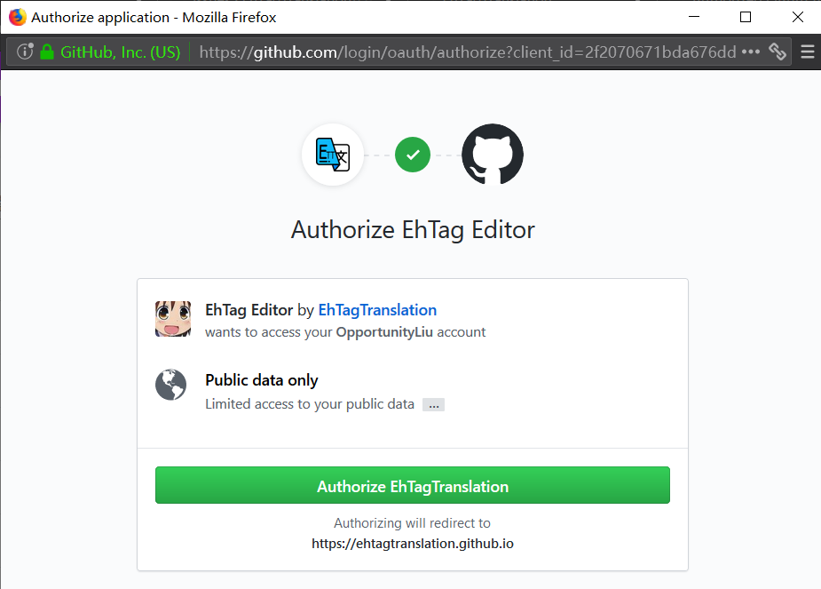

注册并登录 GitHub 账号
=====
本项目使用 GitHub 管理翻译数据，记录用户的贡献。因此，在提交翻译之前，需要准备一个 GitHub 账号，并在 [GitHub](/login) 完成登录。具体操作比较简单，实在不会可以百度。

完成后进入[编辑器主页](//EhTagTranslation.GitHub.io/Editor)，点击右上角的“登录”按钮。  

在弹出的窗口中选择“Authorize EhTagTranslation”即可将已经在 GitHub 登录的账户授权用于向 EhTagTraslation 项目提交翻译并记录贡献。  

完成后右上角将显示已登录用户的头像及名字。可点击该处管理登录信息。  

浏览标签
=====
标签浏览页面如下图。  

1. **搜索**  
   在搜索框中输入内容进行检索。检索范围包括所有标签的中英文名称、描述和外部链接。可以用 `/regex/` 格式的检索词启用正则表达式检索。此时搜索框右侧将显示 `.*` 表示正在使用正则匹配。  
   
1. **图片显示**  
   可以选择标签浏览页中的图片显示方式。该选项仅在图片浏览页面生效，且只会影响显示效果。
1. **命名空间过滤**  
   点击命名空间名称或 rows 命名空间下的标签名称，可以依据命名空间过滤标签。点击搜索框右边过滤命名空间右侧的“x”可清除过滤器。  
   
1. **开始编辑**  
   点击标签左侧的铅笔图标编辑相应的标签，点击表头的加号图标添加新的标签。部分标签处于锁定状态，无法编辑，需要前往[数据库](../../Database)通过 Issues 或 PRs 进行编辑。

编辑标签
=====
标签编辑页面如下图。  

左侧为编辑区域，在此处选择添加标签的命名空间，输入原始标签名称、中文名称、描述和外部链接。各字段的填写要求参见[参与翻译](../../Database/wiki/参与翻译)指南。

其中标“*”的为必填项，标“”的表示相应字段支持输入 MarkDown 文本。

可以点击“原始标签”及“名称”右侧的放大镜图标，在搜索引擎中查询合适的翻译、图片和描述等信息。  

编辑完成后可以点击“预览”按钮，在右侧的预览窗格中显示预览效果。

**强烈建议提交前先预览一下最终的编辑结果。**

确认无误后点击“提交”按钮提交翻译。提交可能需要较长时间，请不要在“更改已提交”的提示出现前关闭页面。  

当翻译内容由于某些原因无法提交时，可以将鼠标悬浮在灰色的“提交”按钮上查看原因。